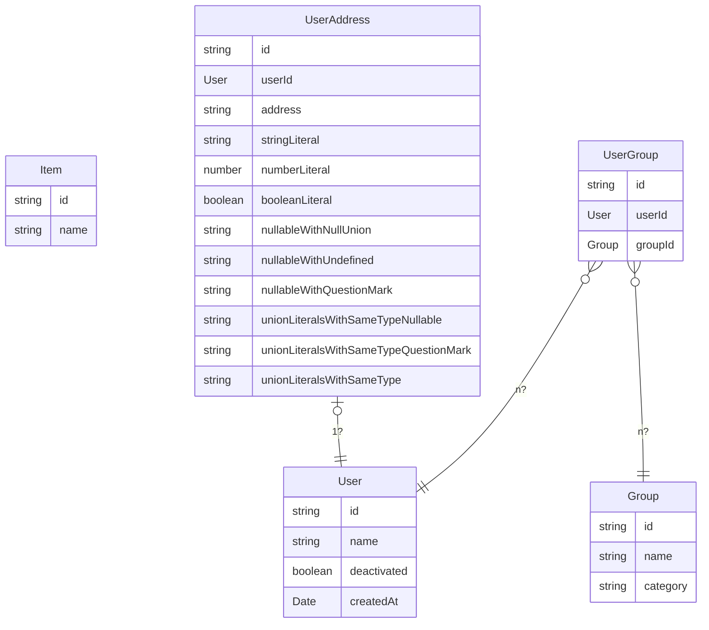

# entity-relation-diagram-from-ast

[](https://dl.circleci.com/status-badge/redirect/gh/HiromiShikata/entity-relation-diagram-from-ast/tree/main)
[](https://github.com/prettier/prettier)
[](https://github.com/semantic-release/semantic-release)

A command-line tool to output entity relation diagram with Mermaid format from AST.



## Installation

```bash
npm install -g entity-relation-diagram-from-ast
```

## Usage

```bash
npx entity-relation-diagram-from-ast /path/to/dir/for/types/of/entity
```

## Contributing

Contributions are welcome! Please create a pull request for any changes or bug fixes.

## License

This project is licensed under the MIT License - see the [LICENSE](LICENSE) file for details.

## Authors

- [HiromiShikata](https://github.com/HiromiShikata)

## Acknowledgements

This project was inspired by [ast-to-entity-definitions](https://github.com/pbojinov/ast-to-entity-definitions).

## FAQs

#### What is the format of the output?

The output format is [Mermaid](https://mermaid-js.github.io/mermaid/#/).

#### Can I output the diagram in another format?

Not currently, but this may be added in future updates.

## Troubleshooting

Please refer to the project's [issues page](https://github.com/HiromiShikata/entity-relation-diagram-from-ast/issues) for any known issues.

## Roadmap

Future updates to this project may include:

- More output format options
- Improved error handling and messaging
- Additional customization options
